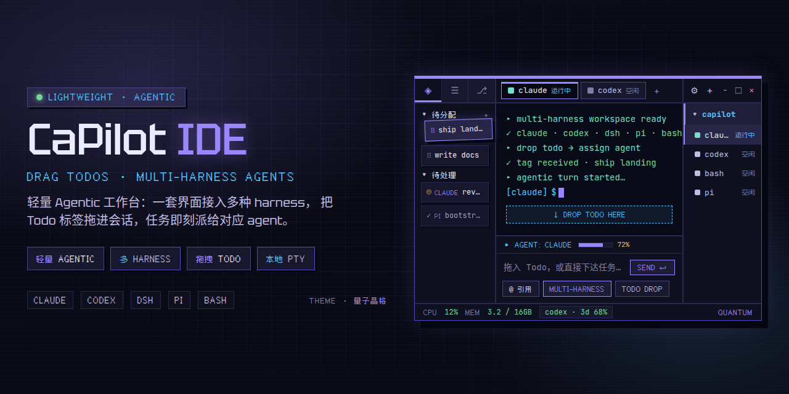

<div align="center">

  

  <h1>CaPilot IDE</h1>

  <p><b>LIGHTWEIGHT AGENTIC WORKSPACE</b></p>

  <p>
    轻量 Agentic 工作台 · 一套界面接入多种 harness<br/>
    把 Todo 标签拖进会话，任务即刻派给 claude / codex / dsh / pi / bash<br/>
    全部跑在本机真实 PTY 上
  </p>
    <a href="#license"></a>
    
    
    

  <p>
    <a href="https://github.com/hachi7574/CaPilot-WebsSite"><b>官网 / Website</b></a>
  </p>

</div>

---

## 这是什么？

**CaPilot IDE** 是一个本地 AI 编程工作区（Local AI coding workspace）。

它不是又一个“把网页包进 Electron”的壳，而是用 **Tauri v2 + Rust** 做的轻量桌面外壳：  
多 harness 会话、真实 PTY 终端、Todo 拖拽派工、文件管理与 Git，都在同一张工作台上完成。

| 你想做的事 | CaPilot 怎么做 |
| --- | --- |
| 同时开多个 AI CLI | claude / codex / dsh / pi / bash 分标签页常驻 |
| 把任务派给 agent | 左侧 Todo 标签 **拖进会话** 即派工 |
| 看 agent 真实输出 | 每个 harness 跑在 **本机真实 PTY**（xterm.js 渲染） |
| 改代码 / 看 diff | 内置 CodeMirror 6 编辑器 + Git SCM |
| 关掉再回来 | 会话持久化到本地 SQLite，惰性恢复 |

> A light agentic desk for many harnesses — drag todo tags into a session and hand the work to claude, codex, dsh, pi or bash on a real local PTY.

---

## 特性

### 核心能力

| | 特性 | 说明 |
| --- | --- | --- |
| 🪶 | **轻量 Agentic** | Tauri v2 外壳，低内存、快启动，没有 Electron 臃肿 |
| 🧩 | **多 Harness** | 一个工作区接入 claude / codex / dsh / pi / bash，标签页切换 |
| 🏷️ | **拖拽 Todo 标签** | 工作收成 Todo，拖进任意 agent 会话，松手即派工 |
| 📁 | **文件管理 + Git** | 内置文件树与完整 Git SCM：diff、提交图谱、worktree、暂存、分支 |

### 更多

- **真实 PTY 终端** — agent TUI 按作者原意渲染，会话画面实时展开（xterm.js + Rust PTY）
- **Composer 输入栏** — 终端下方命令式输入：打字、拖入 Todo、回车发送
- **CodeMirror 6 编辑器** — 语法高亮、diff 视图，适配暗色工作区
- **会话持久化** — 默认 `~/CaPilot/sessions.db`（可写安装目录下会落到 `<安装目录>/data`）
- **上下文窗口监控** — 实时 token 用量 vs 模型容量
- **Todo + 批注** — 计划始终附着在接手它的 agent 会话上
- **主题 / 视频壁纸** — 官方主题资源随包分发；Linux 视频壁纸依赖 GStreamer（见下）

<details>
<summary><b>支持的 Harness（点击展开）</b></summary>

| Harness | 状态 | 说明 |
| --- | --- | --- |
| **Bash / OS Shell** | Supported | 本机默认 shell（Windows: pwsh/cmd；Unix: `$SHELL`） |
| **Claude Code** | Supported | Anthropic 智能体编码 harness |
| **Codex** | Supported | OpenAI 编码智能体 harness |
| **Pi** | Supported | Pi coding agent，真实 PTY 标签页 |
| **DeepSeek (dsh)** | Experimental | dsh-TUI harness |

Roadmap：Cursor · Codebuddy · Coder · Omp · Gemini · Grok

</details>

---

## 支持平台

| 平台 | 安装包 | 状态 |
| --- | --- | --- |
| **Linux x64** | `.AppImage` / `.deb` | ✅ 官方支持 |
| **Windows x64** | NSIS `.exe` installer | ✅ 官方支持 |

> Release CI / bundle targets 仅 `deb` · `appimage` · `nsis`。  
> 源码里少量 `#[cfg(target_os = "macos")]` 路径无历史保留，**无官方支持**。

---

## 快速安装（预编译包）

### 1. 下载

到 **[Releases · Latest](https://github.com/hachi7574/CaPilot-IDE/releases/latest)** 选择对应资产：

| 平台 | 文件名模式 | 示例（v0.1.21） |
| --- | --- | --- |
| Windows | `CaPilot_*_x64-setup.exe` | `CaPilot_0.1.21_x64-setup.exe` |
| Linux | `CaPilot_*_amd64.AppImage` | `CaPilot_0.1.21_amd64.AppImage` |
| Linux | `CaPilot_*_amd64.deb` | `CaPilot_0.1.21_amd64.deb` |

也可直接打开官网下载区：  
https://github.com/hachi7574/CaPilot-WebsSite

### 2. Windows

1. 运行 `CaPilot_*_x64-setup.exe`
2. 安装模式可选：**当前用户** / **全部用户**（NSIS `installMode: both`）
3. 系统需已具备 **WebView2**（Win10/11 通常自带；缺失时安装  
   [Evergreen Runtime](https://developer.microsoft.com/microsoft-edge/webview2/)）
4. 视频壁纸走 WebView2 系统编解码，**无需额外包**

### 3. Linux · deb（推荐桌面发行版）

```bash
# Debian / Ubuntu
sudo apt install ./CaPilot_*_amd64.deb
```

`.deb` 已声明运行时依赖：

- `libwebkit2gtk-4.1-0`
- `libgtk-3-0`
- `libdbus-1-3`
- `gstreamer1.0-libav`
- `gstreamer1.0-plugins-bad`（Ubuntu 需启用 **universe**）

### 4. Linux · AppImage

```bash
chmod +x CaPilot_*_amd64.AppImage
./CaPilot_*_amd64.AppImage
```

> AppImage **不会**自带 GStreamer 插件。若要用**视频壁纸**，请先装主机解码依赖（下一节）。

---

## 环境与系统要求

### A. 最终用户（跑预编译包）

| 项目 | 要求 |
| --- | --- |
| **OS** | 64-bit Linux 或 64-bit Windows |
| **CPU / 架构** | x86_64 / amd64 |
| **显示** | 图形桌面环境；最低窗口约 960×600，默认 1400×900 |
| **Windows** | WebView2 Runtime |
| **Linux** | WebKitGTK 4.1 + GTK 3（deb 会拉依赖） |
| **网络** | 可选。用于检查更新（GitHub Releases / 镜像）与各 AI CLI 自身联网 |
| **磁盘** | 安装包约 80–160 MB；数据目录随会话增长 |
| **内存** | 建议 ≥ 4 GB 可用（同时开多个 agent 时按 CLI 实际占用叠加） |

#### Linux 视频壁纸（运行时媒体）

主题视频壁纸通过 WebKitGTK `<video>` → **GStreamer** 播放，内置主题统一为 **H.264**。

| 场景 | 是否需要手动装插件 |
| --- | --- |
| `.deb` 安装 | 一般 **否**（Depends 已声明；Ubuntu 请开 universe） |
| AppImage | **是** |
| 源码 `tauri dev` / `tauri build` 后本地跑 | **是** |
| Windows | **否**（WebView2 系统解码） |

```bash
# Debian / Ubuntu
sudo apt install gstreamer1.0-libav gstreamer1.0-plugins-bad

# Fedora
sudo dnf install gstreamer1-libav gstreamer1-plugins-bad-free

# Arch
sudo pacman -S gst-libav gst-plugins-bad

# 验证 H.264 解码器
gst-inspect-1.0 avdec_h264 | head
```

#### 数据目录（部署 / 便携）

| 安装形态 | 数据根 |
| --- | --- |
| 可写安装目录（便携、当前用户 NSIS、用户自有路径） | `<安装目录>/data` |
| 不可写安装（`deb`→`/usr/bin`、AppImage 只读挂载、Program Files 全用户） | `~/CaPilot` |
| 开发态（`target/debug\|release`） | `~/CaPilot` |
| **显式覆盖** | 环境变量 `CAPILOT_HOME` |

会话库：`<data_root>/sessions.db`（兼容说明见 RUNBOOK）。

> ⚠️ **不要**在 `/usr/bin/data` 建目录。不可写位置请用 `~/CaPilot` 或 `CAPILOT_HOME`。

#### 使用 AI Harness 的额外前提

CaPilot 本身是工作台；各 agent 需本机已安装并可在 `PATH` 中调用，例如：

| Harness | 你需要准备 |
| --- | --- |
| Claude Code | `claude` CLI，并完成登录 / 授权 |
| Codex | `codex` CLI，并完成登录 / 授权 |
| Pi | `pi`（`@earendil-works/pi-coding-agent`） |
| dsh | `dsh` + dsh-TUI 插件（实验性） |
| Shell | 系统默认 shell 即可 |

Windows 下 npm 全局 shim（`.cmd` / `.bat`）已按 PATH+PATHEXT 解析，一般无需再包一层 Git Bash。

---

## 从源码构建（开发 / 部署构建环境）

适用于二次开发、打本地安装包、或 CI 复现构建。

### 1. 工具链要求

| 依赖 | 版本 | 说明 |
| --- | --- | --- |
| **Rust** | **1.97+** | 推荐 [rustup](https://rustup.rs/) |
| **Node.js** | **24+** | 前端与 Vite 7 |
| **pnpm** | 最新稳定 | 包管理；仓库含 `pnpm-lock.yaml` |
| **Git** | 任意近年版本 | 克隆与 SCM 功能 |
| **Tauri CLI** | v2（经 `pnpm` 引入 `@tauri-apps/cli`） | `pnpm tauri …` |

可选但常用：

| 可选 | 用途 |
| --- | --- |
| `claude` CLI | `pnpm tauri dev` 联调 Claude harness 时需要 |
| 各 AI CLI | 本地验证对应 runtime |
| `gst-inspect-1.0` | 检查 Linux 视频解码 |

### 2. Linux 构建依赖（-dev，一次性）

编译 Tauri/WebKit 绑定需要开发头文件：

```bash
# Debian / Ubuntu
sudo apt install \
  libwebkit2gtk-4.1-dev \
  librsvg2-dev \
  libgtk-3-dev \
  libsoup-3.0-dev \
  libjavascriptcoregtk-4.1-dev
```

> 跑 `pnpm tauri dev` **之前**请先装好上述依赖，否则链接阶段会失败。

若还要在开发机预览视频壁纸，再装运行时 GStreamer 插件（见上一节）。

### 3. Windows 构建依赖

| 依赖 | 说明 |
| --- | --- |
| Visual Studio Build Tools | 含 C++ 工具链，供 Rust MSVC target 使用 |
| WebView2 | 开发机与目标机均需 |
| Node 24+ / pnpm / Rust 1.97+ | 同通用工具链 |

### 4. 获取源码并安装前端依赖

```bash
git clone https://github.com/hachi7574/CaPilot-IDE.git
cd CaPilot-IDE
pnpm install
```

### 5. 开发模式

```bash
pnpm tauri dev
```

- 前端 Vite dev server：`http://localhost:1420`
- 热更新 UI；Rust 侧改动会触发重新编译

### 6. 生产构建（打安装包）

```bash
pnpm tauri build
```

产物位置（典型）：

```text
src-tauri/target/release/bundle/
├── deb/        # .deb
├── appimage/   # .AppImage
└── nsis/       # Windows setup.exe
```

Bundle targets（`tauri.conf.json`）：

```json
"targets": ["deb", "appimage", "nsis"]
```

### 7. 校验 / 测试命令

```bash
# TypeScript 类型检查
pnpm tsc --noEmit

# 前端单测（终端鼠标协议等）
pnpm test:terminal-mouse

# Rust 单元测试
cd src-tauri && cargo test
```

### 8. 构建产物里带了什么

| 资源 | 说明 |
| --- | --- |
| `themes/` | 官方主题 JSON + `wallpapers/`，映射到包内 `$RESOURCE/themes/` |
| `name-packs/` | 终端随机名称库，映射到 `$RESOURCE/name-packs/` |
| 应用图标 | Linux hicolor 多尺寸 PNG；Windows `icon.ico` |
| Updater 元数据 | `createUpdaterArtifacts: true`，发布时可出 `latest.json` + `.sig` |

Windows NSIS / 便携：资源通常在 exe 旁可见。  
Linux deb / AppImage：在包 resource 树内（常见 `/usr/lib/<app>/…` 或 AppImage 只读镜像），**不在** `/usr/bin`。

---

## 自动更新

应用内 updater 会按顺序请求：

1. `https://github.com/hachi7574/CaPilot-IDE/releases/latest/download/latest.json`
2. `https://ghfast.top/https://github.com/hachi7574/CaPilot-IDE/releases/latest/download/latest.json`
3. `https://gh-proxy.com/https://github.com/hachi7574/CaPilot-IDE/releases/latest/download/latest.json`

（国内网络可走镜像；签名校验使用发布公钥。）

---

## 技术栈

| 层 | 技术 | 角色 |
| --- | --- | --- |
| Desktop shell | **Tauri v2** | Rust + 系统 WebView |
| UI | **React 19** + TypeScript | 前端框架 |
| Build | **Vite 7** | 前端构建 |
| Editor | **CodeMirror 6** | 代码编辑 / diff |
| Terminal | **xterm.js** | 终端渲染 |
| State | **zustand** | 前端状态 |
| Core | **Rust** | PTY、FS、Git、session DB、runtime 集成 |

---

## 项目结构

```text
CaPilot-IDE/
├── src-tauri/          # Rust 核心、Tauri 配置、PTY / Git / runtime
├── ui/                 # React 前端
├── public/             # 运行时静态资源（字体、logo）
├── themes/             # 官方主题 + 壁纸（打进安装包）
├── name-packs/         # 终端名称库（打进安装包）
├── docs/               # 手册、安全评审、AI runtime 参考、README 配图
│   ├── assets/
│   │   └── cover-1280x640.png
│   ├── CaPilot-IDE-RUNBOOK.md
│   ├── ai-runtime-references.md
│   └── security-review.md
└── package.json
```

---

## 文档地图

| 文档 | 内容 |
| --- | --- |
| [`docs/CaPilot-IDE-RUNBOOK.md`](docs/CaPilot-IDE-RUNBOOK.md) | 如何跑、已知坑、数据目录、主题、权限默认等落地记录 |
| [`docs/ai-runtime-references.md`](docs/ai-runtime-references.md) | claude / codex / opencode / dsh / pi 集成事实与官方文档索引 |
| [`docs/security-review.md`](docs/security-review.md) | 安全评审与发布检查清单 |
| [`docs/styleguide/`](docs/styleguide/) | LUCY 设计规范（8-bit Pixel × Apple Smooth） |

---

## 路线图（Harness）

```text
Now        claude · codex · dsh · pi · bash/shell
Next       Cursor · Codebuddy · Coder · Omp · Gemini · Grok
```

---

## License

[MIT](./LICENSE) · © 2026 hachi7574

Built with **Tauri · React · Rust**.